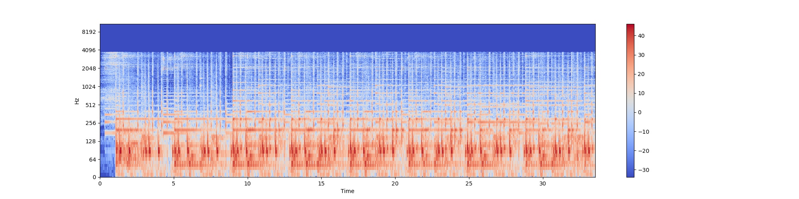
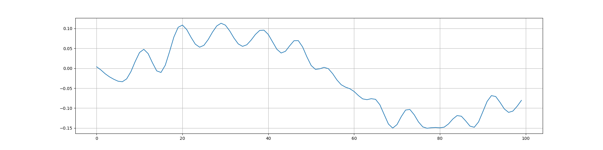
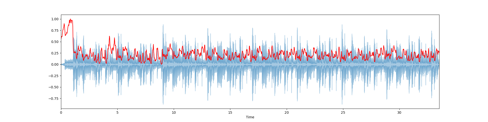
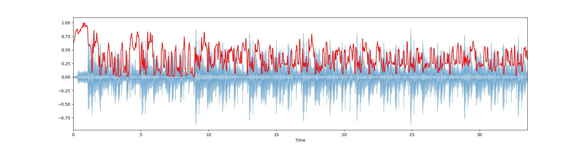
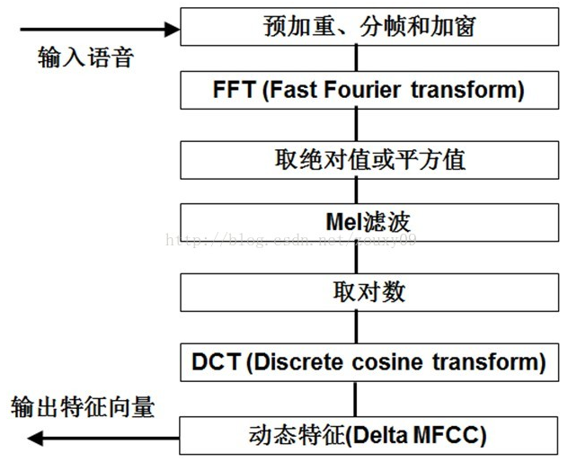
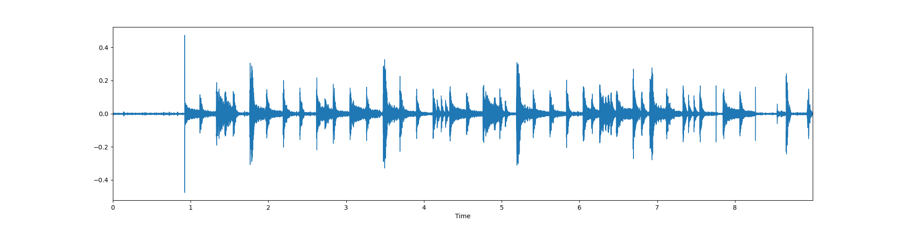

## Python audio signal processing
Achieve music genre classification and feature extraction. 

### Intro
The power spectrum of the music signal is similar to that of the human brain physiological signal, 
which complies with the 1/f signal formula.
 The alpha value of music signal approaches 1 means 
 music is more pleasant.
 A sound is represented in the form of an audio signal having parameters such as frequency, bandwidth, decibel, etc., 
 and a typical audio signal may be represented as a function of amplitude and time. 
 
 
### Install
```shell script
conda install -c conda-forge librosa
# conda env create -f environment.yml
```

### Implementation
In process.py, we do visualization of the audio.
- Waveplot

- Spectrum

- zero-crossing rate

- Spectral Centroids

- Spectral Roll-Off


In create.py, we create 5 second audio.

### Additional Materials
[link](https://blog.csdn.net/zouxy09/article/details/9156785#:~:text=%E6%A2%85%E5%B0%94%E9%A2%91%E7%8E%87%E5%80%92%E8%B0%B1%E7%B3%BB%E6%95%B0%EF%BC%88Mel%20Frequency%20Cepstrum%20Coefficient,%E7%BB%9F%E4%B8%80%E7%9A%84%E6%BB%A4%E6%B3%A2%E5%99%A8%E7%BB%84%E3%80%82)   
MFCCs（Mel Frequency Cepstral Coefficents）
- 共振峰(Formants)
- 频谱
- 包络 (Spectral Envelop)
- MFCCs
- 倒谱（cepstrum）就是一种信号的傅里叶变换经对数运算后再进行傅里叶反变换得到的谱。

梅尔频率倒谱系数（Mel Frequency Cepstrum Coefficient, MFCC）考虑到了人类的听觉特征，先将线性频谱映射到基于
听觉感知的Mel非线性频谱中，然后转换到倒谱上。

MFCC Character 提取特征 

We choose an audio that has some loop.
