# Task 1 Python audio signal processing
Achieve music genre classification and feature extraction. 

### Intro
The power spectrum of the music signal is similar to that of the human brain physiological signal, 
which complies with the 1/f signal formula.
 The alpha value of music signal approaches 1 means 
 music is more pleasant.
 A sound is represented in the form of an audio signal having parameters such as frequency, bandwidth, decibel, etc., 
 and a typical audio signal may be represented as a function of amplitude and time. 
 
 
### Install
```shell script
conda install -c conda-forge librosa
# conda env create -f environment.yml
```

### Implementation
In process.py, we do visualization of the audio.
- Waveplot
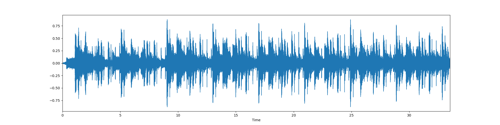
- Spectrum

- zero-crossing rate
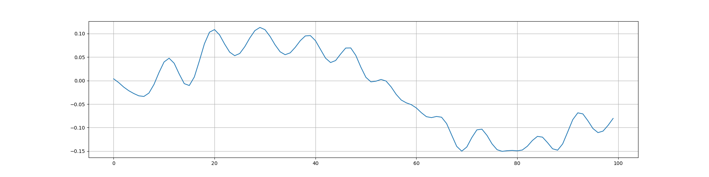
- Spectral Centroids
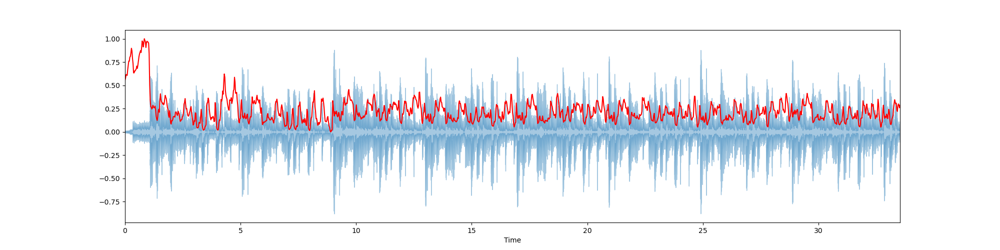
- Spectral Roll-Off
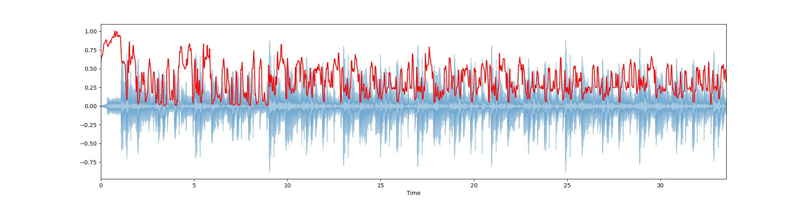

In create.py, we create 5 second audio.

### Additional Materials
[link](https://blog.csdn.net/zouxy09/article/details/9156785#:~:text=%E6%A2%85%E5%B0%94%E9%A2%91%E7%8E%87%E5%80%92%E8%B0%B1%E7%B3%BB%E6%95%B0%EF%BC%88Mel%20Frequency%20Cepstrum%20Coefficient,%E7%BB%9F%E4%B8%80%E7%9A%84%E6%BB%A4%E6%B3%A2%E5%99%A8%E7%BB%84%E3%80%82)   
MFCCs（Mel Frequency Cepstral Coefficents）
- 共振峰(Formants)
- 频谱
- 包络 (Spectral Envelop)
- MFCCs
- 倒谱（cepstrum）就是一种信号的傅里叶变换经对数运算后再进行傅里叶反变换得到的谱。

梅尔频率倒谱系数（Mel Frequency Cepstrum Coefficient, MFCC）考虑到了人类的听觉特征，先将线性频谱映射到基于
听觉感知的Mel非线性频谱中，然后转换到倒谱上。

MFCC Character 提取特征 
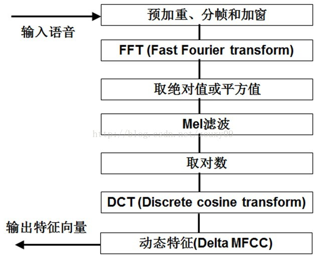
We choose an audio that has some loop.
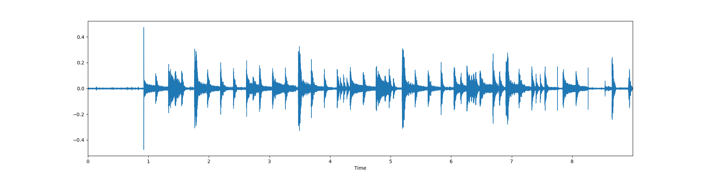
We calculate MFCC 
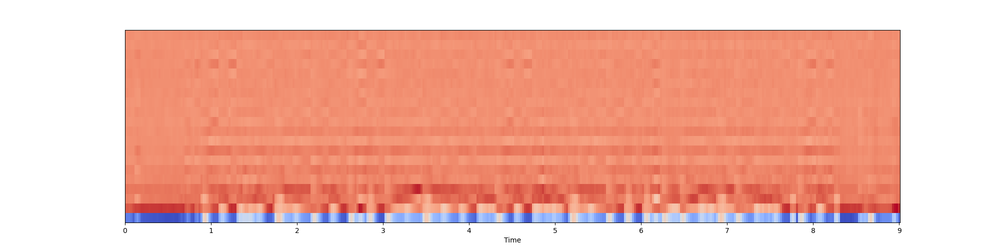
We scale up the characteristics. Make mean = 0 and mean square = 1
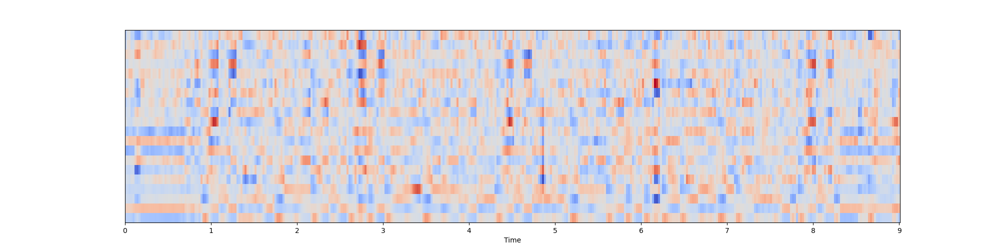
Chromaticity frequency
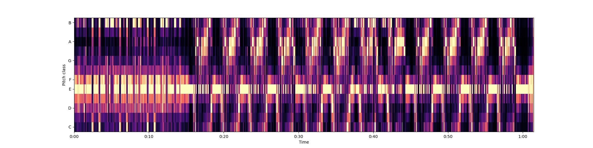

### Task 2 The Sound of AI
We choose 3 .wav file to plot out the waveplot with their amplitude envelope.
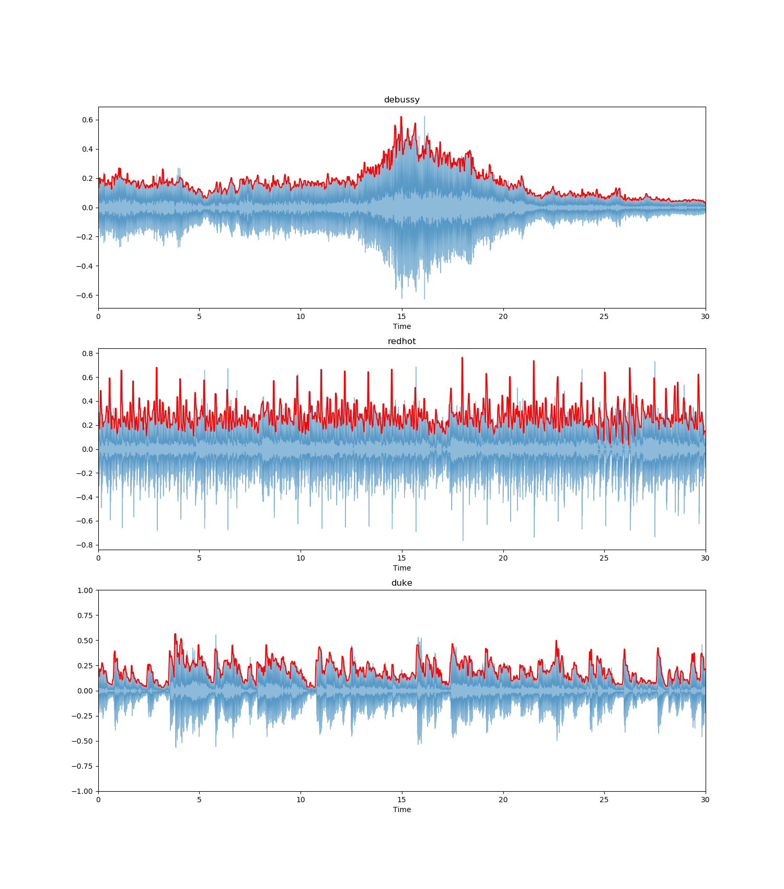
We first use librosa.feature.rms to calculate the rms Energy and plot on the graph as the red line shows.

Then we try to implement the rms function use mathematical formula. We plot it as the yellow line and compare
with the previous red line. We see there is no big difference.
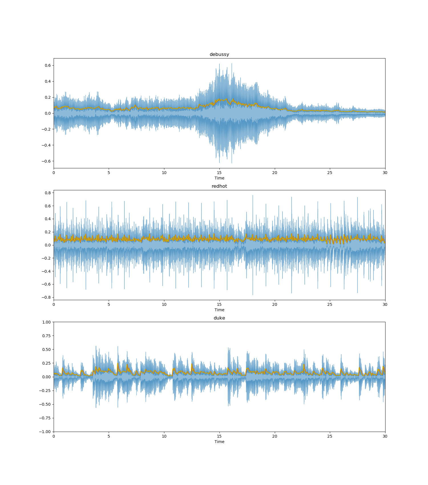

Now we aim to visualize the zero-crossing rate. This compares the zero crossing rate of those 3 .wav files.
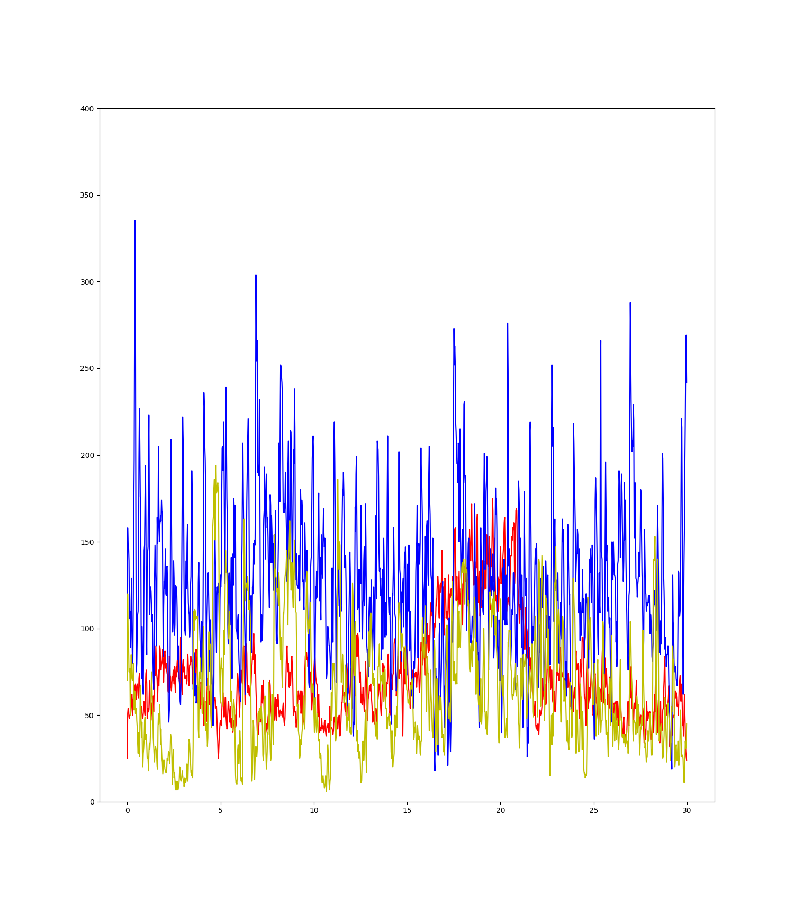
We can maunally chose set the scaler or not.

We also compare the zcr of a music file and a noise file.
It is clear that noise file has higher ZCR then a music file.
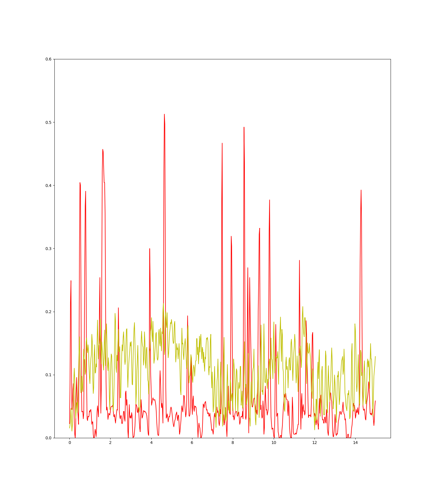

#### Introduction to Fourier Transform
We plot out the time domain and frequency domain of the signal.
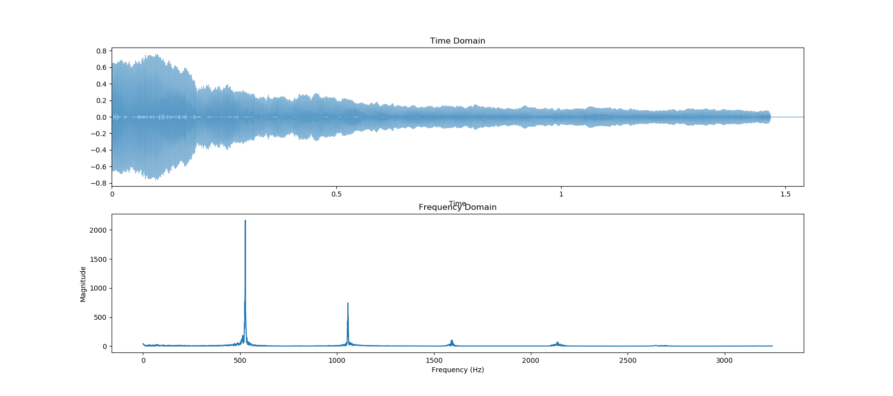
We can see a peak in the magnitude around 523 hz, which is the specific frequency for c5
This is the fundamental of the sound we heard.
Have a few spikes. They are harmonics or overtones of the fundamental frequency.

Fourier Transform: Step by Step
1. Choose a frequency to create a sin wave
2. Optimize the phase to give maximum similarity (max area)
3. Calculate Magnitude: Magnitude = positive area of the combined signal - negative area

Do Step 1-3 for all possible frequencies. And check which frequency is the most important component to all signals.
In our case, the most import frequency is 523. And the best phase to choose is 0.55.

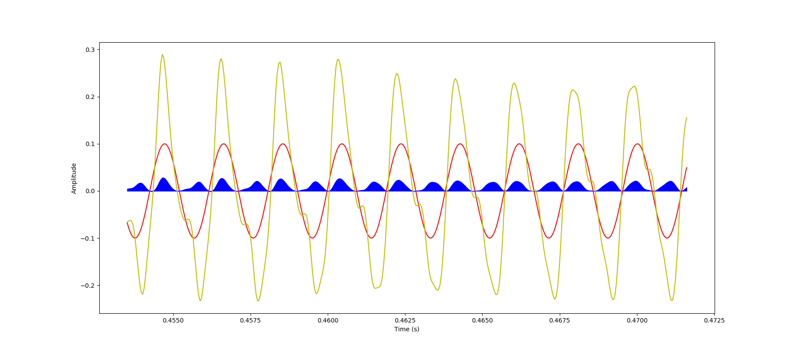
The red line is created sine wave. The yellow line is signal. The blue part
represents the similarity.

### Task 3 Audio Processing in Python
Speech preprocessing In deep learning, speech input is processed as needed: 
Framing and windowing Pre-emphasis 
Zero crossing rate 
Short-term energy
